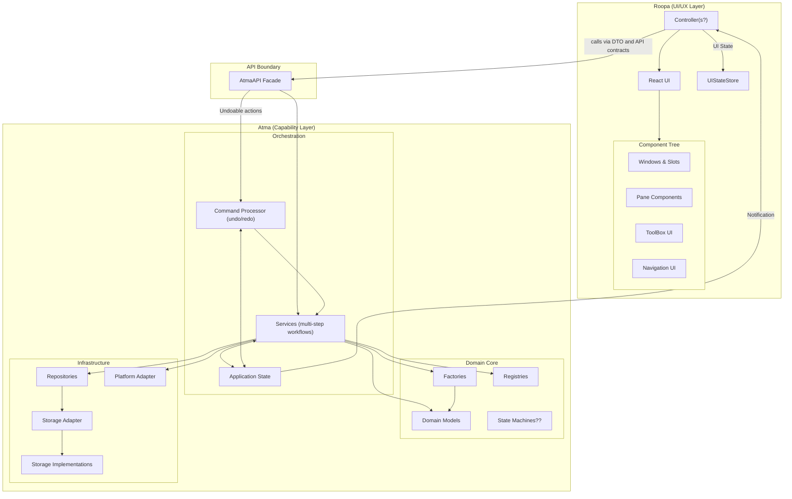
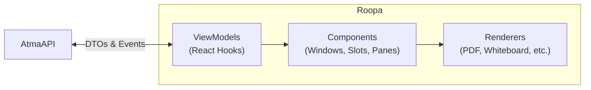

# Atma + Roopa: Architectural Blueprint for LemmaMap

## The Core Idea

```
LemmaMap = Atma (capability) + Roopa (UI/UX)
e.g., atma1.3 + roopa0.2
```

**Atma** is everything the app *can do*. **Roopa** is everything the user *sees and touches*. They communicate exclusively through a defined API boundary—no reaching across, no shortcuts, no "just this once."

---

## Current State Audit

Your codebase already has strong architectural instincts. Here's what exists:

| Layer | Files | Patterns Used | Health |
|-------|-------|--------------|--------|
| Domain Models | `domain_models/*.ts` | Domain Model, Discriminated Union | ✅ Solid — actively used for marks |
| Mark Registry | `capabilty_registry/pdf/` | Registry + Strategy | ✅ Working — 3 mark types registered and used |
| Tool/Content Registry | `capabilty_registry/` | Registry | 🟡 Scaffolded — code exists, nothing registered |
| Factories | `object_factories/*.ts` | Factory | 🔴 Minimal — only `createMarkId()` exists |
| Storage (new 3-tier) | `storage/` | Repository, Adapter | 🔴 **All empty stubs** — planned but not built |
| Storage (legacy) | `storage.js` | Monolith | ⚠️ Working monolith (360 lines) — all actual persistence |
| Platform Adapter | `platform_adapter/` | Adapter, Strategy | ✅ Solid — Tauri fully implemented |
| Services | `services/*.ts` | Service Layer | 🔴 **All 6 files are empty stubs** |
| Mark Implementations | `implementations/pdf/marks/` | Strategy (MarkType) | ⚠️ Working but **mixes capability + JSX rendering** |
| UI | `WorkWindow.jsx`, `HomeScreen.jsx` | — | 🔴 Monolithic (1344 + 778 lines), all logic here |

> [!IMPORTANT]
> **The fundamental problem**: Your app is in an **active refactoring transition**. The new architecture scaffolding (services, storage 3-tier, factories) is set up as directories and files, but they're **all empty stubs**. Meanwhile, ALL working logic lives in two monoliths:
> - [WorkWindow.jsx](file:///home/akshat/Desktop/recursenotes/pdf-board/src/WorkWindow.jsx) (1344 lines, 40+ useState hooks) — contains all workspace logic + rendering
> - [HomeScreen.jsx](file:///home/akshat/Desktop/recursenotes/pdf-board/src/HomeScreen.jsx) (778 lines) — contains all library/settings logic + rendering
> - [storage.js](file:///home/akshat/Desktop/recursenotes/pdf-board/src/storage.js) (360 lines) — contains all persistence (localStorage + IndexedDB)
>
> The Atma/Roopa split means extracting all business logic from these files into the Atma layer, then rebuilding Roopa as a pure rendering layer that calls `AtmaAPI`.
>
> Additionally, your mark implementations (`rectangle_mark.tsx`, etc.) blend capability logic (hit-testing, shape math) with JSX rendering — these need to be split so the capability half goes to Atma and the render half goes to Roopa.

---

## Proposed Architecture



---

## Layer 1: Atma (Capability Layer)

Atma is organized into three sub-layers: **Infrastructure → Domain Core → Orchestration**. Dependencies flow upward only.

---

### 1.1 Infrastructure Sub-Layer

> *"Hide the messy world behind clean interfaces."*

#### Storage (Already Built ✅)

Your three-tier storage architecture is excellent. Keep it as-is:

```
StorageImplementations (localStorage, IndexedDB)
        ↓ used by
StorageAdapter (unified interface)
        ↓ used by
Repositories (domain-oriented queries)
```

**Patterns in play:**
- **Adapter Pattern** → `StorageAdapter` hides localStorage vs. IndexedDB
- **Repository Pattern** → `ContentRepository`, `MarkRepository` expose domain queries

#### Platform Adapter (Already Built ✅)

Your `PlatformAdapter` interface + `switch.ts` strategy selector is clean.

**Patterns in play:**
- **Adapter Pattern** → `PlatformAdapter` interface hides Tauri vs. Web vs. Android
- **Strategy Pattern** → `switch.ts` selects implementation at build time

#### 🆕 Cache-Aside Layer

Add a cache layer between repositories and the rest of Atma. This is critical for performance when you have recursive pane trees.

```typescript
// src/atma/infrastructure/cache/content_cache.ts
class ContentCache {
  private cache = new Map<string, ContentInstance>();
  
  async get(id: string): Promise<ContentInstance> {
    if (this.cache.has(id)) return this.cache.get(id)!;
    const content = await this.contentRepo.getContent(id);
    this.cache.set(id, content);
    return content;
  }
  
  invalidate(id: string) { this.cache.delete(id); }
  invalidateAll() { this.cache.clear(); }
}
```

**Pattern: Cache-Aside** → Check cache first, fall back to repository, populate cache on miss.

---

### 1.2 Domain Core Sub-Layer

> *"The heart of what the app knows and enforces."*

#### Domain Models (Already Built ✅)

Your discriminated unions (`ContentInstance`, `MarkInstance`) are well-designed. Keep them.

**One addition — add a `TreeNode` model** for recursive content navigation:

```typescript
// src/atma/domain/models/tree_model.ts
interface ContentTreeNode {
  content: ContentInstance;
  marks: MarkInstance[];
  children: Map<string, ContentTreeNode>; // markId → child node
  parent: { markId: string; contentId: string } | null;
  depth: number;
}
```

#### Factories (Partially Built 🟡)

Complete the `MarkFactory` and add validation:

```typescript
// src/atma/domain/factories/mark_factory.ts
function createRectangleMark(params: {
  parentContentId: string;
  pageIndex: number;
  x: number; y: number; width: number; height: number;
  linkedContentType: string;
}): RectangleMark {
  // Validation: coordinates must be 0-1 relative
  if (params.x < 0 || params.x > 1) throw new Error('x must be relative (0-1)');
  // ... more validation
  return {
    id: crypto.randomUUID(),
    type: 'rectangle',
    color: generateDistinctColor(),
    linkedContentId: null, // filled by LinkCreationService
    ...params,
  };
}
```

**Pattern: Factory Pattern** → Centralized creation with validation and defaults.

#### Registries (Partially Built 🟡)

You have `ContentRegistry`. Add two more:

```typescript
// 1. Tool Registry — manages all available tools per content type
// Pattern: Registry Pattern
const toolRegistry = new Map<string, Map<ToolId, ToolConfig>>();
registerToolsForContent('pdf', [selectTool, rectangleTool, lassoTool, sectionTool, removeTool]);
registerToolsForContent('whiteboard', [selectTool, rectangleTool, removeTool]);

// 2. Mark Type Registry — manages mark types and their renderers
const markTypeRegistry = new Map<string, MarkTypeConfig>();
registerMarkType('rectangle', { factory: createRectangleMark, validator: validateRect });
registerMarkType('lasso', { factory: createLassoMark, validator: validateLasso });
registerMarkType('section', { factory: createSectionMark, validator: validateSection });
```

**Pattern: Registry Pattern** → `Map<typeId, config>` with register/get/getAll. Every time you add a new content type, tool, or mark type, you register it—no switch statements scattered through the codebase.

#### 🆕 Tool State Machine

Your tool system (`select → rectangle → lasso → section → remove`) is actually a **state machine** that currently lives inside `WorkWindow.jsx`. Extract it:

```typescript
// src/atma/domain/state_machines/tool_state_machine.ts
type ToolPhase = 'idle' | 'drawing' | 'confirming';

interface ToolStateMachine {
  currentTool: ToolId;
  phase: ToolPhase;
  dragState: DragState | null;
  
  selectTool(toolId: ToolId): void;
  startDrag(point: Point): void;
  updateDrag(point: Point): void;
  completeDrag(): MarkInstance | null;  // returns created mark or null
  cancel(): void;
}
```

**Pattern: State Machine Pattern** → Explicit states and transitions. The state machine *owns* what tools are allowed to do, independent of any UI.

---

### 1.3 Orchestration Sub-Layer

> *"Coordinate multi-step workflows. This is where the 'intelligence' of the app lives."*

#### Services (Partially Built 🟡)

Your services exist but the UI bypasses them. The fix: **make services the ONLY way to perform operations**. No direct repo/factory calls from outside Atma.

Consolidate and expand into these services:

| Service | Responsibility | Patterns Used |
|---------|---------------|---------------|
| `ContentService` | Create, read, delete content. Manages lifecycle. | **Service Layer**, **Facade** |
| `MarkService` | Create, read, delete marks. Validates mark data. | **Service Layer**, **Specification** |
| `LinkService` | Create/traverse mark↔content links. Tree navigation. | **Service Layer**, **Composite** |
| `NavigationService` | Manage pane stack, slot assignments, history. | **Service Layer**, **Memento** |
| `ImportExportService` | Import PDFs, export workspaces. | **Service Layer**, **Pipeline** |
| `ToolService` | Manage tool state machine, process tool actions. | **Service Layer**, **State Machine** |
| `SyncService` | Auto-save, debounced persistence. | **Service Layer**, **Observer** |
| `LibraryService` | Manage library folder, list PDFs, organize. | **Service Layer**, **Repository** |

Example — `NavigationService` using **Memento Pattern** for undo:

```typescript
// src/atma/orchestration/services/navigation_service.ts
class NavigationService {
  private history: WindowLayout[] = [];
  private currentIndex: number = -1;

  openContentInSlot(contentId: string, slot: PanePosition): void {
    const newLayout = this.buildLayout(contentId, slot);
    // Memento: save current state before changing
    this.history = this.history.slice(0, this.currentIndex + 1);
    this.history.push(newLayout);
    this.currentIndex++;
    this.eventBus.emit('layout:changed', newLayout);
  }

  goBack(): WindowLayout | null {
    if (this.currentIndex <= 0) return null;
    this.currentIndex--;
    const layout = this.history[this.currentIndex];
    this.eventBus.emit('layout:changed', layout);
    return layout;
  }
}
```

#### 🆕 Command Processor (Undo/Redo)

For user actions that should be undoable:

```typescript
// src/atma/orchestration/commands/command.ts
interface Command {
  readonly description: string;
  execute(): Promise<void>;
  undo(): Promise<void>;
}

// Example: CreateMarkCommand
class CreateMarkCommand implements Command {
  description = 'Create region mark';
  private createdMarkId: string | null = null;
  
  constructor(
    private markService: MarkService,
    private markData: Omit<MarkInstance, 'id'>
  ) {}
  
  async execute() {
    const mark = await this.markService.createMark(this.markData);
    this.createdMarkId = mark.id;
  }
  
  async undo() {
    if (this.createdMarkId) {
      await this.markService.deleteMark(this.createdMarkId);
    }
  }
}
```

**Pattern: Command Pattern** → Every user action is an object that can be executed and undone.

---

### 1.4 The Atma Facade (API Boundary)

> [!IMPORTANT]
> **This is the single most important piece of the architecture.** Roopa talks to Atma through ONE object. Not through services directly, not through repositories, not through factories. ONE facade.

```typescript
// src/atma/api/atma_api.ts

// --- DTOs (Data Transfer Objects) ---
// Pattern: DTO / API Contracts
// These are the ONLY shapes that cross the Atma↔Roopa boundary.
// They are NOT the same as domain models. They are simplified views.

interface ContentDTO {
  id: string;
  type: string;
  name: string;
  icon: string;
  markCount: number;
}

interface MarkDTO {
  id: string;
  type: 'rectangle' | 'lasso' | 'section';
  color: string;
  geometry: RectGeometry | LassoGeometry | SectionGeometry;
  linkedContentId: string | null;
  linkedContentType: string | null;
}

interface WorkspaceDTO {
  leftPane: PaneDTO | null;
  rightPane: PaneDTO | null;
  splitRatio: number;
  breadcrumbs: BreadcrumbDTO[];
  availableTools: ToolDTO[];
  activeTool: ToolId;
}

// --- The Facade ---
// Pattern: Facade Pattern

class AtmaAPI {
  // Content operations
  async getContent(id: string): Promise<ContentDTO> { ... }
  async getAllContents(): Promise<ContentDTO[]> { ... }
  async deleteContent(id: string): Promise<void> { ... }
  
  // Mark operations
  async getMarksForContent(contentId: string): Promise<MarkDTO[]> { ... }
  async createMark(params: CreateMarkParams): Promise<MarkDTO> { ... }
  async deleteMark(markId: string): Promise<void> { ... }
  
  // Navigation
  async openMark(markId: string): Promise<WorkspaceDTO> { ... }
  async navigateBack(): Promise<WorkspaceDTO> { ... }
  async getWorkspaceState(): Promise<WorkspaceDTO> { ... }
  
  // Tools
  selectTool(toolId: ToolId): void { ... }
  startToolAction(point: Point): void { ... }
  updateToolAction(point: Point): void { ... }
  completeToolAction(): Promise<MarkDTO | null> { ... }
  cancelToolAction(): void { ... }
  
  // Import / Export
  async importPdf(): Promise<ContentDTO> { ... }
  async exportWorkspace(): Promise<Blob> { ... }
  
  // Library
  async selectLibraryFolder(): Promise<string> { ... }
  async getLibraryPdfs(): Promise<LibraryEntryDTO[]> { ... }
  async openPdf(pdfId: string): Promise<WorkspaceDTO> { ... }
  
  // Undo / Redo
  async undo(): Promise<WorkspaceDTO> { ... }
  async redo(): Promise<WorkspaceDTO> { ... }
  canUndo(): boolean { ... }
  canRedo(): boolean { ... }
  
  // Settings
  getSettings(): SettingsDTO { ... }
  updateSettings(patch: Partial<SettingsDTO>): void { ... }
  
  // Events (Roopa subscribes to these)
  on(event: AtmaEvent, handler: EventHandler): Unsubscribe { ... }
}

// Pattern: Pub-Sub / Observer
type AtmaEvent = 
  | 'workspace:changed'
  | 'content:created' | 'content:deleted'
  | 'mark:created' | 'mark:deleted'
  | 'tool:changed' | 'tool:action:updated'
  | 'navigation:changed'
  | 'sync:started' | 'sync:completed'
  | 'error:occurred';
```

**Patterns at the boundary:**
- **Facade Pattern** → `AtmaAPI` is the single entry point. Roopa never reaches past it.
- **DTO Pattern** → Data crossing the boundary is transformed from rich domain models into flat, UI-friendly shapes.
- **Observer / Pub-Sub** → Atma emits events, Roopa subscribes. Decouples state changes from UI updates.
- **Anti-Corruption Layer** → DTOs prevent Roopa from depending on Atma's internal model shapes. If Atma refactors `ContentInstance`, Roopa doesn't break—only the DTO mapper changes.

---

## Layer 2: Roopa (UI/UX Layer)

> *"Roopa never does business logic. It receives data, renders it, and sends user intents back to Atma."*

### 2.1 Architecture



### 2.2 ViewModels (React Hooks)

Each major UI concern gets a custom hook that wraps `AtmaAPI` calls:

```typescript
// src/roopa/viewmodels/useWorkspace.ts
// Pattern: MVVM (ViewModel as React Hook)

function useWorkspace(atma: AtmaAPI) {
  const [workspace, setWorkspace] = useState<WorkspaceDTO | null>(null);
  
  useEffect(() => {
    // Subscribe to Atma events
    const unsub = atma.on('workspace:changed', (ws) => setWorkspace(ws));
    // Load initial state
    atma.getWorkspaceState().then(setWorkspace);
    return unsub;
  }, [atma]);
  
  // Actions — thin wrappers that delegate to Atma
  const openMark = useCallback((markId: string) => atma.openMark(markId), [atma]);
  const goBack = useCallback(() => atma.navigateBack(), [atma]);
  const selectTool = useCallback((toolId: ToolId) => atma.selectTool(toolId), [atma]);
  
  return { workspace, openMark, goBack, selectTool };
}
```

```typescript
// src/roopa/viewmodels/useToolInteraction.ts
// Handles mouse/touch → tool state machine delegation

function useToolInteraction(atma: AtmaAPI, containerRef: RefObject<SVGElement>) {
  const [currentDrag, setCurrentDrag] = useState<DragVisual | null>(null);
  
  useEffect(() => {
    const unsub = atma.on('tool:action:updated', (drag) => setCurrentDrag(drag));
    return unsub;
  }, [atma]);
  
  const handlers = useMemo(() => ({
    onPointerDown: (e: PointerEvent) => {
      const point = screenToRelative(e, containerRef.current!);
      atma.startToolAction(point);
    },
    onPointerMove: (e: PointerEvent) => {
      const point = screenToRelative(e, containerRef.current!);
      atma.updateToolAction(point);
    },
    onPointerUp: () => atma.completeToolAction(),
  }), [atma]);
  
  return { currentDrag, handlers };
}
```

### 2.3 Component Hierarchy

```
Window
├── Slot (left)
│   └── PaneRenderer (dispatches by content type)
│       ├── PdfPaneView (react-pdf rendering + mark overlays)
│       ├── WhiteboardPaneView (tldraw rendering + mark overlays)
│       ├── TextEditorPaneView (future)
│       └── ... (other content type views)
├── Slot (right)
│   └── PaneRenderer (same dispatch)
├── ToolBox
│   └── ToolButton × N
├── BreadcrumbBar
└── NavigationControls
```

**Pattern: Composite Pattern** → The window/slot/pane tree is a composite. Each node renders its children.

**Pattern: Strategy Pattern (on UI side)** → `PaneRenderer` looks up the content type and dispatches to the correct view component. This mirrors the `ContentRegistry` on the Atma side:

```typescript
// src/roopa/components/PaneRenderer.tsx

// Pattern: Strategy — select renderer by content type
const RENDERERS: Record<string, React.ComponentType<PaneViewProps>> = {
  'pdf': PdfPaneView,
  'whiteboard': WhiteboardPaneView,
  'blocktext': TextEditorPaneView,
  // ... extensible
};

function PaneRenderer({ pane }: { pane: PaneDTO }) {
  const Renderer = RENDERERS[pane.contentType];
  if (!Renderer) return <UnsupportedContentView type={pane.contentType} />;
  return <Renderer pane={pane} />;
}
```

**Pattern: Null Object Pattern** → `UnsupportedContentView` is a null-object renderer. Instead of crashing or showing nothing for unknown content types, it renders a graceful fallback.

### 2.4 Roopa's Adapter Pattern (for UI Libraries)

Just as Atma has a `PlatformAdapter`, Roopa should have adapters for its UI dependencies:

```typescript
// src/roopa/adapters/whiteboard_adapter.ts
// Pattern: Anti-Corruption Layer / Adapter

interface WhiteboardAdapter {
  mount(container: HTMLElement, config: WhiteboardConfig): void;
  unmount(): void;
  getShapes(): Shape[];
  onShapeChange(handler: (shapes: Shape[]) => void): Unsubscribe;
}

// Current implementation wraps tldraw
class TldrawWhiteboardAdapter implements WhiteboardAdapter {
  // ... wraps tldraw-specific API
}

// Future: could swap to excalidraw, or a custom canvas
```

This means if you ever swap tldraw for another library, only the adapter changes—not a single component.

---

## Pattern Map: Complete Reference

Here is every pattern in the architecture and exactly where it lives:

| # | Pattern | Layer | Where | Why |
|---|---------|-------|-------|-----|
| 1 | **Domain Model** | Atma: Domain | `domain_models/*.ts` | Define object shapes without behavior |
| 2 | **Factory** | Atma: Domain | `object_factories/*.ts` | Centralized object creation + validation |
| 3 | **Registry** | Atma: Domain | `capabilty_registry/` | Extensible type→config maps for content, tools, marks |
| 4 | **State Machine** | Atma: Domain | `state_machines/tool_state_machine.ts` | Tool modes + transitions without UI coupling |
| 5 | **Repository** | Atma: Infra | `storage/repository/` | Domain-oriented storage queries |
| 6 | **Adapter** | Atma: Infra | `storage/storage_adapter/`, `platform_adapter/` | Hide implementation differences |
| 7 | **Strategy** | Atma: Infra | `platform_adapter/switch.ts` | Build-time platform selection |
| 8 | **Cache-Aside** | Atma: Infra | `cache/*.ts` | Performance for repeated reads |
| 9 | **Service Layer** | Atma: Orchestration | `services/*.ts` | Coordinate multi-step workflows |
| 10 | **Facade** | API Boundary | `AtmaAPI` | Single entry point for all capability |
| 11 | **DTO / API Contracts** | API Boundary | `api/dtos/*.ts` | Decouple internal models from UI shapes |
| 12 | **Anti-Corruption Layer** | API Boundary | DTO mappers | Protect Roopa from Atma's internal changes |
| 13 | **Observer / Pub-Sub** | API Boundary | `EventBus` | Atma emits, Roopa subscribes |
| 14 | **Command** | Atma: Orchestration | `commands/*.ts` | Undo/redo for user actions |
| 15 | **Memento** | Atma: Orchestration | `NavigationService` history | Save/restore navigation state |
| 16 | **Pipeline** | Atma: Orchestration | `ImportExportService` | Multi-step import/export flow |
| 17 | **Composite** | Roopa | Window → Slot → Pane tree | Recursive UI composition |
| 18 | **MVVM** | Roopa | ViewModels (React Hooks) | Bind UI state to Atma data |
| 19 | **Strategy** | Roopa | `PaneRenderer` dispatch | Select renderer by content type |
| 20 | **Null Object** | Roopa | `UnsupportedContentView` | Graceful fallback for unknown types |
| 21 | **Adapter** | Roopa | `WhiteboardAdapter`, `PdfViewerAdapter` | Isolate from UI library internals |
| 22 | **Specification** | Atma: Domain | Mark validation rules | Composable validation predicates |
| 23 | **Decorator** | Roopa | Mark overlay rendering | Layer visual decorations (hover, select, drag preview) |
| 24 | **Mediator** | Atma: Orchestration | `AtmaAPI` (internally) | Services don't call each other directly |

---

## Directory Structure (Proposed)

```
src/
├── atma/                           # CAPABILITY LAYER
│   ├── api/
│   │   ├── atma_api.ts             # The Facade — single entry point
│   │   ├── dtos/                   # DTO type definitions
│   │   │   ├── content_dto.ts
│   │   │   ├── mark_dto.ts
│   │   │   ├── workspace_dto.ts
│   │   │   └── ...
│   │   ├── mappers/                # Domain model ↔ DTO converters
│   │   │   ├── content_mapper.ts
│   │   │   ├── mark_mapper.ts
│   │   │   └── ...
│   │   └── event_bus.ts            # Pub-Sub event system
│   │
│   ├── domain/
│   │   ├── models/                 # Pure type definitions (existing)
│   │   ├── factories/              # Object creation (existing, expand)
│   │   ├── state_machines/         # Tool state machine (extract from UI)
│   │   └── validators/             # Specification pattern validators
│   │
│   ├── orchestration/
│   │   ├── services/               # Business workflow services (existing, expand)
│   │   │   ├── content_service.ts
│   │   │   ├── mark_service.ts
│   │   │   ├── link_service.ts
│   │   │   ├── navigation_service.ts
│   │   │   ├── tool_service.ts
│   │   │   ├── import_export_service.ts
│   │   │   ├── library_service.ts
│   │   │   └── sync_service.ts
│   │   └── commands/               # Undo/redo command objects
│   │       ├── command.ts
│   │       ├── command_processor.ts
│   │       ├── create_mark_command.ts
│   │       └── delete_mark_command.ts
│   │
│   ├── infrastructure/
│   │   ├── storage/                # 3-tier storage (existing)
│   │   │   ├── implementations/
│   │   │   ├── adapter/
│   │   │   └── repository/
│   │   ├── platform/               # Platform adapter (existing)
│   │   │   ├── interface.ts
│   │   │   ├── tauri.ts
│   │   │   ├── web.ts
│   │   │   └── switch.ts
│   │   └── cache/                  # Cache-aside layer
│   │       └── content_cache.ts
│   │
│   └── registry/                   # All registries (existing, expand)
│       ├── content_registry.ts
│       ├── tool_registry.ts
│       ├── mark_type_registry.ts
│       └── setup.ts                # Bootstrap all registrations
│
├── roopa/                          # UI/UX LAYER
│   ├── viewmodels/                 # React hooks (MVVM ViewModels)
│   │   ├── useWorkspace.ts
│   │   ├── useToolInteraction.ts
│   │   ├── useLibrary.ts
│   │   ├── useMarks.ts
│   │   ├── useNavigation.ts
│   │   └── useSettings.ts
│   │
│   ├── components/
│   │   ├── window/                 # Window/Slot/Pane composite
│   │   │   ├── Window.tsx
│   │   │   ├── Slot.tsx
│   │   │   └── PaneRenderer.tsx
│   │   ├── toolbox/                # Tool UI
│   │   │   ├── ToolBox.tsx
│   │   │   └── ToolButton.tsx
│   │   ├── navigation/             # Breadcrumbs, back button
│   │   │   ├── BreadcrumbBar.tsx
│   │   │   └── NavigationControls.tsx
│   │   ├── library/                # Home screen / library UI
│   │   │   ├── LibraryGrid.tsx
│   │   │   └── PdfCard.tsx
│   │   └── shared/                 # Reusable UI primitives
│   │       ├── Modal.tsx
│   │       ├── ContextMenu.tsx
│   │       └── SettingsPanel.tsx
│   │
│   ├── pane_views/                 # Content-type-specific renderers
│   │   ├── PdfPaneView.tsx
│   │   ├── WhiteboardPaneView.tsx
│   │   └── UnsupportedContentView.tsx
│   │
│   ├── adapters/                   # UI library adapters
│   │   ├── tldraw_adapter.ts
│   │   └── pdf_viewer_adapter.ts
│   │
│   ├── styles/                     # All CSS
│   │   ├── index.css
│   │   ├── window.css
│   │   ├── toolbox.css
│   │   └── library.css
│   │
│   └── App.tsx                     # Root — creates AtmaAPI, provides context
│
├── main.tsx                        # Entry point
└── shared/                         # Truly shared types (Point, Color, etc.)
    └── primitives.ts
```

---

## The In-Process vs. REST Question

> [!IMPORTANT]
> **Recommendation: Start with in-process, design for extraction.**

You asked: *"MVVM? Real API boundary? What do I want?"*

Here are the options:

| Approach | Pros | Cons | When |
|----------|------|------|------|
| **In-Process Facade** (recommended now) | Zero latency, simple, no serialization overhead | Boundary is a convention, not enforced | Single app, same-process UI + logic |
| **REST API (FastAPI-style)** | True process boundary, any UI can connect | Latency, complexity, serialization overhead, need a server | Multi-client, server-hosted, or very large teams |
| **Web Worker Boundary** | Enforced boundary in browser, non-blocking | postMessage overhead, can't share references | Web-only, heavy computation |

**My recommendation**: Use the **In-Process Facade** now. The `AtmaAPI` class lives in the same JS bundle as Roopa. But because you're using DTOs and events (not passing internal objects), you *could* later put Atma behind a Web Worker, a REST API, or even a Tauri Rust backend—the Roopa side wouldn't change.

The key discipline: **Never import from `src/atma/` in Roopa except through `atma_api.ts` and `dtos/`**. Enforce this with an ESLint rule:

```javascript
// eslint rule: no-restricted-imports
{
  "paths": [{
    "name": "../../atma/domain/*",
    "message": "Roopa must not import Atma internals. Use AtmaAPI and DTOs."
  }]
}
```

---

## Dependency Injection Strategy

How do all these pieces get wired together?

```typescript
// src/atma/api/create_atma.ts
// Pattern: Dependency Injection (manual, no framework needed)

export function createAtma(platform: 'tauri' | 'web' | 'android'): AtmaAPI {
  // Infrastructure
  const localStorageImpl = new LocalStorageImpl();
  const indexedDBImpl = new IndexedDBImpl();
  const storageAdapter = new StorageAdapter(localStorageImpl, indexedDBImpl);
  const contentRepo = new ContentRepository(storageAdapter);
  const markRepo = new MarkRepository(storageAdapter);
  const contentCache = new ContentCache(contentRepo);
  const platformAdapter = getPlatformAdapter(platform);
  
  // Domain
  const contentRegistry = new ContentRegistry();
  const toolRegistry = new ToolRegistry();
  const markTypeRegistry = new MarkTypeRegistry();
  bootstrapRegistries(contentRegistry, toolRegistry, markTypeRegistry);
  
  // Orchestration
  const eventBus = new EventBus();
  const contentService = new ContentService(contentRepo, contentCache, eventBus);
  const markService = new MarkService(markRepo, markTypeRegistry, eventBus);
  const linkService = new LinkService(contentService, markService, eventBus);
  const toolService = new ToolService(toolRegistry, markService, eventBus);
  const navigationService = new NavigationService(contentService, eventBus);
  const importExportService = new ImportExportService(platformAdapter, contentService, markService);
  const libraryService = new LibraryService(platformAdapter, contentService);
  const syncService = new SyncService(contentService, markService, eventBus);
  const commandProcessor = new CommandProcessor(eventBus);
  
  // Facade
  return new AtmaAPI({
    contentService, markService, linkService, toolService,
    navigationService, importExportService, libraryService,
    syncService, commandProcessor, eventBus,
  });
}
```

```typescript
// src/roopa/App.tsx
// Pattern: MVVM — AtmaAPI provided via React Context

const AtmaContext = createContext<AtmaAPI | null>(null);

function App() {
  const [atma] = useState(() => createAtma(import.meta.env.VITE_PLATFORM || 'tauri'));
  
  return (
    <AtmaContext.Provider value={atma}>
      <Router>
        <Route path="/" element={<LibraryScreen />} />
        <Route path="/workspace/:contentId" element={<WorkspaceScreen />} />
      </Router>
    </AtmaContext.Provider>
  );
}

// Hook for components to access Atma
function useAtma(): AtmaAPI {
  const atma = useContext(AtmaContext);
  if (!atma) throw new Error('useAtma must be used within AtmaContext');
  return atma;
}
```

---

## State Management: Who Owns What?

| State | Owner | Why |
|-------|-------|-----|
| Content tree, marks, pane stacks | **Atma** (services + repos) | Business data — must survive UI changes |
| Current tool, drag state | **Atma** (ToolService + state machine) | Business rules about what tools can do |
| Navigation history | **Atma** (NavigationService) | Undo/back logic is business logic |
| Which panel is hovered | **Roopa** (local component state) | Pure visual concern |
| Scroll position, zoom level | **Roopa** (local state) but **synced to Atma** | UI controls it, Atma persists it |
| Modal open/closed | **Roopa** (local state) | Pure UI |
| Animation states | **Roopa** (CSS/local state) | Pure visual |
| Settings | **Atma** (persisted) → **Roopa** (reads via DTO) | Atma owns, Roopa displays |

**Rule of thumb**: If destroying and recreating the entire UI should preserve it → **Atma owns it**. If it's only meaningful while the user is looking at the screen → **Roopa owns it**.

---

## Open Questions

> [!IMPORTANT]
> ### Q1: State Management Library for Roopa
> The ViewModel hooks need to hold and distribute workspace state to deeply nested components. Options:
> - **React Context + useReducer** (simplest, no deps)
> - **Zustand** (lightweight, minimal boilerplate)
> - **Jotai** (atom-based, good for fine-grained updates)
> 
> Since Atma is the source of truth, Roopa's state management is just a "projection cache." I'd recommend **Zustand** or even just Context—keep it simple.

> [!IMPORTANT]
> ### Q2: Event Bus Implementation
> - **Simple custom EventEmitter** (50 lines of code, zero deps)
> - **RxJS Subjects** (powerful but heavy)
> - **mitt** (tiny, battle-tested library)
> 
> I'd recommend a custom EventEmitter or `mitt`. You don't need RxJS's complexity.

> [!IMPORTANT]
> ### Q3: TypeScript Migration
> Your `.jsx` files contain the bulk of the logic. The new architecture is TypeScript-first. Should the migration to this architecture also be the migration to TypeScript?

> [!IMPORTANT]
> ### Q4: Legacy `storage.js`
> The old [storage.js](file:///home/akshat/Desktop/recursenotes/pdf-board/src/storage.js) (12KB) appears to be a legacy monolith from before the 3-tier storage refactoring. Should it be deleted/migrated?

---

## Migration Plan (Phased)

> [!WARNING]
> Do NOT attempt a big-bang rewrite. Migrate incrementally. The app must remain functional after each phase.

### Phase 1: Complete Atma's Foundation (1-2 weeks)
- Complete `MarkFactory` (currently stub)
- Register all content types in `ContentRegistry`
- Create `ToolRegistry` and `MarkTypeRegistry`
- Extract tool state machine from `WorkWindow.jsx` → `tool_state_machine.ts`
- Expand services to cover all operations currently done directly in JSX

### Phase 2: Build the API Boundary (1 week)
- Define all DTOs
- Create DTO mappers
- Build `EventBus`
- Build `AtmaAPI` facade that delegates to services
- Write the `createAtma()` factory function

### Phase 3: Build Roopa Shell (1-2 weeks)
- Create ViewModel hooks that consume `AtmaAPI`
- Build the component hierarchy (Window → Slot → PaneRenderer)
- Wire up the first working screen using only `AtmaAPI`
- Keep old JSX files as reference, build new ones in `roopa/`

### Phase 4: Migrate Content Renderers (1 week)
- Move PDF rendering to `PdfPaneView` in `roopa/pane_views/`
- Move whiteboard rendering to `WhiteboardPaneView`
- Create UI adapters for tldraw and react-pdf

### Phase 5: Delete Legacy (1 week)
- Remove `WorkWindow.jsx`, `HomeScreen.jsx`
- Remove `storage.js`
- Add ESLint import boundary rules
- Final testing

---

## Verification Plan

### Automated Tests
```bash
# Atma unit tests — test services, factories, state machines in isolation
npm run test -- --filter "atma/"

# Integration tests — test AtmaAPI facade end-to-end
npm run test -- --filter "api/"

# Roopa component tests — test that components render correctly given DTOs
npm run test -- --filter "roopa/"
```

### Manual Verification
- Core loop: Open PDF → Draw region → Whiteboard opens → Draw on whiteboard → Navigate back → Region still exists
- All keyboard shortcuts functional
- Import/Export produces valid data
- Cross-platform: `npm run build:tauri` and `npm run build:web` both produce working builds
