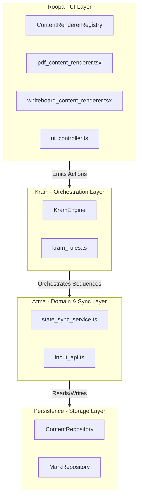

# Separation of Concerns Matrix: Agnosticism & Architectural Boundaries

This document defines the architectural boundaries for the application, mapping what each main node/file/method must remain agnostic about, and grouping them into explicit Separation of Concerns layers.

---

## 1. Agnosticism Matrix

| Architectural Node / File / Method | Layer | What it MUST be Agnostic About (Things it should NOT know) |
| :--- | :--- | :--- |
| **`ContentRendererRegistry`**   `content_renderer_registry.ts` | Roopa (UI Registration) | - **Layout Structure**: Doesn't know if slots are left/right, grid, or tabs. - **Navigation/History**: Doesn't know about history stacks or back-navigation. - **State Synchronization**: Ignorant of SQLite db tables, sync rules, or RAG capabilities. |
| **`pdf_content_renderer.tsx`** | Roopa (UI Component) | - **Layout Context**: Doesn't know what slot it is in (`left`/`right`) or if other slots exist. - **Opposite Content**: Completely unaware of what is in the other slot (e.g. doesn't know there is a whiteboard). - **Sequencing**: Doesn't decide to open a whiteboard when a mark is clicked; it only emits the selection trigger to the controller. |
| **`whiteboard_content_renderer.tsx`** | Roopa (UI Component) | - **Slot Position**: Doesn't know if it is side-by-side or fullscreen. - **Persistence Details**: Doesn't know about SQLite; it calls standard `inputAPI`/`queryAPI` endpoints to save/load snapshots. - **Relation**: Unaware of what PDF or mark it was opened from. |
| **`ui_controller.ts`** | Roopa (UI Control Hub) | - **Layout Topology**: Doesn't hardcode left/right relationships. - **Orchestration Rules**: Doesn't know that closing a whiteboard should clear a PDF mark selection. - **Sync Loops**: Unaware of preventing re-entrancy; it simply executes state mutations on the requested slot ID. |
| **`KramEngine`**   `kram_engine.ts` | Kram (Orchestration) | - **DOM/React Rendering**: Doesn't know how PDFs or whiteboards draw themselves. - **Tauri FS / SQLite**: Doesn't know file paths, folders, or raw SQL syntax. - **Specific APIs**: Doesn't call tldraw or react-pdf methods directly. Works purely on abstract `KramAction` commands. |
| **`kram_rules.ts`** | Kram (Sequencing Logic) | - **State Implementation**: Doesn't know how slots write to the store or DB. - **UI Event Listeners**: Doesn't know about pointer events, coordinates, or clicks. It evaluates pure JSON-like states and returns structural intents. |
| **`state_sync_service.ts`** | Atma (Domain Sync) | - **Slot Layouts**: Doesn't know how slots are displayed visually. - **UI Interactions**: Unaware of hover states, selections, or active tools. It simply diffs store states and schedules debounced writes to SQLite. - **History/Navigation**: Doesn't track back stacks. |
| **`ContentRepository`** / **`MarkRepository`** | Atma (Persistence Data) | - **UI State**: Doesn't know about slots, zoom levels, scroll positions, or active selections. - **User Context**: Doesn't know who or what loaded the content. Works strictly with raw database rows, IDs, and paths. |

---

## 2. Separation of Concerns Groups

The components above are grouped into four primary architectural layers. Each layer has a strict boundary and communication contract.

### Group A: Roopa (The Visual Presentation Layer)
- **Primary Concerns**: Visual layout, rendering content pixels, handling DOM/Pointer events, UI local state (zoom, scrollTop, current tool selection).
- **Communication Boundary**: Must only call `uiController` methods. It never accesses SQLite directly, never references opposite slots, and never manipulates history.

### Group B: Kram (The Interception & Sequence Layer)
- **Primary Concerns**: Navigation sequence, multi-slot state orchestration, history back-stack manipulation, cascading side-effects (e.g. closing slot X closes whiteboard Y).
- **Communication Boundary**: Intercepts actions from `uiController` via a Proxy. Evaluates rules in `kram_rules.ts` and outputs concrete mutation actions to the raw controller and history stack.

### Group C: Atma (The Domain Logic & Synchronization Layer)
- **Primary Concerns**: Domain model integrity, business capability checks, diffing state updates, and triggering persistence.
- **Communication Boundary**: Responds to `InputAPI` commands. Listens to state changes to save them, and provides hydrated domain models (like marks and document properties) to the store.

### Group D: Persistence (The Storage Layer)
- **Primary Concerns**: SQLite queries, file reads/writes (Tauri FS), data schema enforcement, and key-value scopes.
- **Communication Boundary**: Agnostic about everything except file paths, SQL syntax, and data serialization. Accessible only by Atma repositories.
