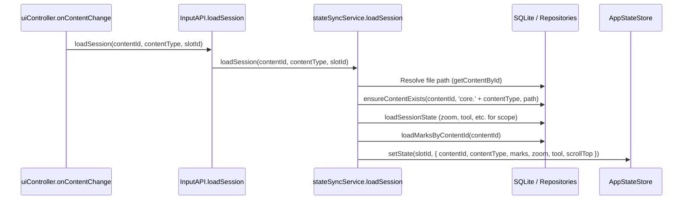

# Codebase Critique: PDF Dominance and Content Agnosticism

This document details the survey and critique of PDF-specific dominance in the `pdf-board` codebase, why the disparity exists, and a concrete roadmap to unify content loading to support features like adding marks on whiteboards.

---

## 1. Where the Disparity Takes Root

The disparity is primarily anchored in the **Atma (Domain Service)** layer and the **InputAPI** definitions, which were designed before the slot-agnostic refactoring.

### Case A: Hardcoded PDF Loading in `state_sync_service.ts`
**Location:** [state_sync_service.ts L183–220](file:///home/akshat/Desktop/recursenotes/pdf-board/src/atma/services/state_sync_service.ts#L183-L220)

The `loadSession` method is defined as:
```ts
async loadSession(store: AppStateStore, output: OutputAPIInterface, pdfPath: string, slotId: string = 'left')
```
Inside this method, it hardcodes:
- `'core.pdf'` when ensuring content exists in the DB.
- `'pdf'` as the `contentType` for the slot.
- Custom state variables (zoom, scrollTop, tool) loaded from the DB specifically under `doc:pdfPath` scope.
- Hardcoded loading of marks from `MarkRepository.loadMarksByContentId(pdfPath)`.

Because this was designed strictly for PDFs, the `ui_controller.ts` had to branch on `contentType`:
```ts
if (contentType === 'pdf') {
    await inputAPI.loadSession(contentId, slotId);
} else {
    // Whiteboards and other types skip session state loading, mark loading, and DB registration!
    rawController.setSlotStates(slotId, { contentId, contentType, slotType: 'verticalPane' });
}
```

### Case B: Whiteboards Bypassing the Domain Layer
Because `loadSession` was PDF-centric:
- Whiteboard contents are loaded dynamically in the UI React component (`whiteboard_content_renderer.tsx`) via `queryAPI.getWhiteboardSnapshot(markId)`.
- The slot state in the store for a whiteboard does **not** contain a `marks` map. Therefore, the whiteboard renderer does not receive marks from the application state, making it impossible to add, delete, or link marks inside whiteboards.

---

## 2. Why This is the Case (Historical Context)

1. **Monolithic Origin**: The application was originally a single-purpose PDF viewer (`pdf-board`). PDFs were the only "documents" containing marks, and the whiteboard was treated as a secondary pop-up panel linked to a PDF mark.
2. **State Sync Focus**: `state_sync_service.ts` was implemented to synchronize PDF-specific scroll positions, zooms, and mark lists.
3. **Incomplete Generalization**: When the layout was updated to support 2 agnosic slots, only the **Roopa (UI Renderer)** layer was fully generalized (via `ContentRendererRegistry`). The **Atma (Domain State/Sync)** layer remained PDF-centric, leading to the branch in `onContentChange`.

---

## 3. How to Make It Uniform (Roadmap)

To enable marks on whiteboards and treat all content types equally, we must make the loading pipeline generic.



### Step 1: Update `InputAPI` and `stateSyncService` Interfaces
Generalize `loadSession` to accept both `contentId` and `contentType`:

```typescript
// input_api.ts
loadSession(contentId: string, contentType: string, slotId?: string): Promise<void>;
```

### Step 2: Generalize `stateSyncService.ts`
Modify `loadSession` to load marks and personalizable state variables based on the `contentType`'s domain configuration:

```typescript
async loadSession(store: AppStateStore, output: OutputAPIInterface, contentId: string, contentType: string, slotId: string = 'left') {
    try {
        // 1. Resolve path from DB if it exists, fallback to contentId (e.g. for PDFs)
        let filePath = contentId;
        try {
            const content = await ContentRepository.getContentById(contentId);
            if (content && content.file_path) {
                filePath = content.file_path;
            }
        } catch (e) {}

        // 2. Ensure content exists in DB (e.g. 'core.whiteboard' or 'core.pdf')
        await ContentRepository.ensureContentExists(contentId, 'core.' + contentType, filePath);

        // 3. Load initial values (zoom, tool, selectedMarkId, scrollTop) based on doc scope
        const docScope = ['doc:' + contentId, 'global'];
        const leftPct = await StateInitialValuesRepository.getInitialValue('personalized', 'leftPct', docScope);
        const selectedMarkId = await StateInitialValuesRepository.getInitialValue('personalized', 'selectedMarkId', docScope);
        const scrollTop = await StateInitialValuesRepository.getInitialValue('personalized', 'scrollTop', docScope);
        const zoom = await StateInitialValuesRepository.getInitialValue('personalized', 'zoom', docScope);
        const tool = await StateInitialValuesRepository.getInitialValue('personalized', 'tool', docScope);
        
        // 4. Load marks associated with this content
        const rawMarks = await MarkRepository.loadMarksByContentId(contentId);
        const parsedMarks = rawMarks.map(parseRawMark);
        const marksMap = new Map(parsedMarks.map((m: any) => [m.id, m]));

        // 5. Create slot state using domain default values
        const existingSlot = store.getState().slots[slotId];
        const baseState = existingSlot && existingSlot.contentType === contentType
            ? existingSlot
            : createDefaultSlotState(contentId, contentType, 'verticalPane', 'ui');

        // 6. Update AppStateStore
        store.setState(draft => {
            draft.leftPct = leftPct;
            draft.slots[slotId] = {
                ...baseState,
                contentId: contentId,
                contentType: contentType,
                zoom: zoom ?? baseState.zoom ?? 1.0,
                tool: tool ?? baseState.tool ?? 'select',
                selectedMarkId: selectedMarkId ?? baseState.selectedMarkId ?? null,
                scrollTop: scrollTop ?? baseState.scrollTop ?? 0,
                marks: marksMap,
                slotType: 'verticalPane'
            };
        });

        // 7. Emit session loaded DTO
        const sessionDTO: SessionDTO = {
            leftPct,
            slots: {
                [slotId]: {
                    contentId: contentId,
                    contentType: contentType,
                    zoom,
                    tool,
                    selectedMarkId,
                    scrollTop,
                    marks: Array.from(marksMap.values())
                }
            }
        };
        output.publish('SESSION_LOADED', sessionDTO);
    } catch (err) {
        console.error(`[StateSyncService] Failed to load session for ${contentId}:`, err);
    }
}
```

### Step 3: Simplify `ui_controller.ts`
Since the hydration is completely generic, we eliminate all branching inside `onContentChange`:

```typescript
onContentChange: async (slotId, contentId, contentType) => {
    await inputAPI.loadSession(contentId, contentType, slotId);
}
```

---

## 4. Enabling Marks on Whiteboards

By making the content loading pipeline generic:
1. **Whiteboards Will Load Marks**: When a whiteboard is opened, `loadSession` will call `MarkRepository.loadMarksByContentId(whiteboardId)`. Since the database query filters by `contentId`, it will load all marks linked to this whiteboard.
2. **State Store Consistency**: The store state for a whiteboard slot will now contain a `marks` map.
3. **Adding Marks**: The whiteboard's `Tldraw` UI or mark tool can trigger `inputAPI.addMark(slotId, mark)` exactly like the PDF does. Since `addMark` operates on the slot ID, it will insert the mark into the database linked to the whiteboard's `contentId`.
4. **Linking Marks**: Since marks on PDFs and whiteboards are stored in the same relational `MARKS` table, we can easily query and display link connections between them.
